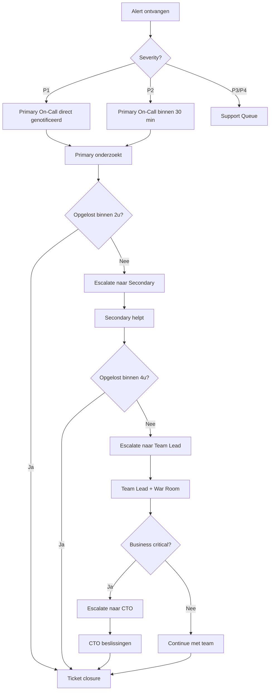

# On-Call Rotation & Escalation Plan

**Versie**: 1.0  
**Laatste Update**: 2025-10-03  
**Eigenaar**: Engineering Team Lead

---

## Overzicht

Dit document beschrijft de on-call rotatie, verantwoordelijkheden, escalatiepaden en compensatie voor JanazApp.

---

## On-Call Rotatie Schema

### Huidige Rotatie (Q1 2026)

| Week Start | Week End | Primary On-Call | Secondary On-Call | Backup |
|-----------|---------|----------------|-------------------|--------|
| 2026-01-06 | 2026-01-12 | Engineer A | Engineer B | Team Lead |
| 2026-01-13 | 2026-01-19 | Engineer B | Engineer C | Team Lead |
| 2026-01-20 | 2026-01-26 | Engineer C | Engineer A | Team Lead |
| 2026-01-27 | 2026-02-02 | Engineer A | Engineer B | Team Lead |

**Rotatie frequentie**: 1 week per engineer  
**Handover tijd**: Maandag 09:00 CET (via Slack + brief meeting)

---

## On-Call Verantwoordelijkheden

### Primary On-Call Engineer

**Beschikbaarheid**:
- **24/7** gedurende on-call week
- Response binnen **15 minuten** voor P1 alerts
- Response binnen **30 minuten** voor P2 alerts

**Taken**:
- Monitor alerts (PagerDuty/OpsGenie/Slack)
- Investigate incidents (use runbooks first!)
- Implement fixes (hotfix deployment)
- Communicate status updates (gebruik templates)
- Escalate naar Secondary indien >2u stuck
- Post-mortem schrijven (P1 verplicht)

**Uitzonderingen**:
- Bij vakantie: swap met collega (2 weken vooraf melden)
- Bij ziekte: Secondary neemt over, backup wordt nieuwe Secondary

---

### Secondary On-Call Engineer

**Beschikbaarheid**:
- **Standby** tijdens Primary's on-call week
- Response binnen **30 minuten** bij escalatie

**Taken**:
- Backup voor Primary indien:
  - Primary niet bereikbaar (na 30 min)
  - Primary vraagt hulp (complex issue)
  - Incident duurt >2 uur
- Review Primary's post-mortems
- Assist bij war rooms (P1)

---

### Backup (Team Lead)

**Beschikbaarheid**:
- **Laatste resort** bij escalaties
- Response binnen **1 uur**

**Taken**:
- Escalatie punt wanneer Primary + Secondary stuck
- Beslissingen over resource allocation
- Klant communicatie bij P1 incidenten
- Escalatie naar CTO indien nodig

---

## Escalatie Flowchart



---

## Alert Channels

### PagerDuty / OpsGenie Setup

**P1 Alerts**:
- SMS + Phone call + App push (Primary)
- Escalate naar Secondary na 15 min non-response
- Escalate naar Team Lead na 30 min non-response

**P2 Alerts**:
- App push + SMS (Primary)
- Escalate naar Secondary na 30 min non-response

**P3/P4 Alerts**:
- Slack #support-queue
- Email naar support@janazapp.nl

---

### Slack Channels

| Channel | Purpose | Who |
|---------|---------|-----|
| **#oncall-alerts** | Real-time P1/P2 alerts | Primary, Secondary, Team Lead |
| **#support-queue** | P3/P4 tickets | Support team, Engineering |
| **#incidents** | Active incident discussions | Alle teams |
| **#postmortems** | Post-mortem reviews | Engineering + Management |

---

## Escalatie Matrix

### Wie belt wie?

| Severity | Initial | Na 30 min | Na 2u | Na 4u | Business Hours Only? |
|----------|---------|-----------|-------|-------|---------------------|
| **P1** | Primary On-Call | Secondary On-Call | Team Lead | CTO | No (24/7) |
| **P2** | Primary On-Call | Secondary On-Call | Team Lead | - | Yes (kantooruren) |
| **P3** | Support Rep | Engineering Queue | Team Lead | - | Yes |
| **P4** | Support Rep | - | - | - | Yes |

---

### Contact Lijst (Emergency)

#### Engineering Team

**Primary On-Call (Week 1)**:
- Naam: Engineer A
- Mobiel: +31 6 XX XX XX XX
- Email: engineer.a@janazapp.nl
- Backup: Engineer B

**Secondary On-Call (Week 1)**:
- Naam: Engineer B
- Mobiel: +31 6 XX XX XX XX
- Email: engineer.b@janazapp.nl

**Team Lead**:
- Naam: [NAAM]
- Mobiel: +31 6 XX XX XX XX (24/7)
- Email: teamlead@janazapp.nl

#### Management

**CTO**:
- Naam: [NAAM]
- Mobiel: +31 6 XX XX XX XX (alleen P1)
- Email: cto@janazapp.nl

**Owner**:
- Naam: [NAAM]
- Mobiel: +31 6 XX XX XX XX (alleen P1 + business critical)
- Email: owner@janazapp.nl

---

## War Room Protocol (P1)

### Wanneer War Room?

- P1 incident duurt >1 uur
- Meerdere componenten down
- Data loss / security breach
- Business critical functionaliteit down

### War Room Deelnemers

**Verplicht**:
- Primary On-Call Engineer
- Secondary On-Call Engineer
- Team Lead

**Optioneel**:
- CTO (bij business impact)
- Product Owner (bij klant communicatie)
- Support Rep (voor klant liaison)

### War Room Meeting

**Platform**: Google Meet (link in Slack pinned message)

**Frequentie**: Elke 30 minuten status update

**Agenda**:
1. **Status update** (wat is de huidige staat?)
2. **Progress** (wat hebben we gedaan sinds vorige update?)
3. **Blockers** (wat houdt ons tegen?)
4. **Next actions** (wat doen we de komende 30 min?)
5. **Communication** (wie update klanten?)

**Notes**: Live gedeeld in Google Doc (link in Slack)

---

## On-Call Compensatie

### Standby Fee

**Per dag on-call**: €50 (€350 per week)

**Geldt voor**: Alle 7 dagen van de on-call week

**Betaling**: Maandelijks, samen met salaris

---

### Call-Out Fee

**Per incident**:
- **P1**: €100 (buiten kantooruren)
- **P2**: €50 (buiten kantooruren)
- **P3/P4**: €0 (verwacht tijdens kantooruren)

**Extra tijd**: €50 per uur indien incident >2u duurt (buiten kantooruren)

---

### Time-Off Compensation

**Per on-call week**: 1 dag compensatie verlof

**Claim**: Via HR systeem binnen 30 dagen na on-call week

**Vervaldatum**: Moet binnen 6 maanden worden opgenomen

---

## Handover Checklist

### Maandag 09:00 CET (Start nieuwe week)

**Outgoing Primary** geeft door aan **Incoming Primary**:

- [ ] Lopende incidenten (status + ETA)
- [ ] Open P2 tickets (welke aandacht nodig?)
- [ ] Upcoming maintenance windows
- [ ] Known issues / workarounds
- [ ] Recent deployment changes
- [ ] Access verificatie (VPN, admin panels, PagerDuty)
- [ ] Runbook updates (zijn er nieuwe procedures?)

**Handover meeting**: 15 minuten (via Slack call of in-person)

**Documentation**: Update in Confluence/Notion

---

## On-Call Readiness Checklist

### Voordat je on-call week start

- [ ] **Laptop volledig charged** (+ charger mee)
- [ ] **Mobiel charged** (+ backup battery)
- [ ] **VPN access getest** (kan je inloggen?)
- [ ] **Admin access geverifieerd** (Supabase, Lovable Cloud, PagerDuty)
- [ ] **Runbooks doorgenomen** (refresh your memory!)
- [ ] **Slack notificaties AAN** (#oncall-alerts)
- [ ] **PagerDuty app geïnstalleerd** (push notificaties AAN)
- [ ] **Emergency contacten opgeslagen** (Secondary, Team Lead, CTO)
- [ ] **Vakantie/afwezigheid gemeld** (swap indien nodig)

---

## Post-Incident Review (Verplicht voor P1)

### Wanneer?

- **P1**: Altijd, binnen 48u na resolution
- **P2**: Optioneel, bij complexe issues
- **P3/P4**: Niet vereist

### Post-Mortem Template

```markdown
# Post-Mortem: [INCIDENT TITLE]

**Datum**: [DATE]
**Severity**: P1 / P2
**Duur**: [START TIME] - [END TIME] (totaal [DURATION])
**Impacted Users**: [NUMBER] gebruikers / [PERCENTAGE]%
**Author**: [NAAM]

---

## Samenvatting

[1-2 zinnen: wat ging er mis?]

---

## Tijdlijn

| Tijd | Event |
|------|-------|
| 14:23 | Alert ontvangen: API latency >5s |
| 14:25 | Primary On-Call start onderzoek |
| 14:35 | Root cause identified: DB connection pool exhausted |
| 14:50 | Fix deployed: increased pool size 10→50 |
| 15:05 | Verified: latency terug naar normaal |
| 15:20 | Incident closed |

---

## Root Cause

[Gedetailleerde analyse: waarom is dit gebeurd?]

---

## Impact

- **Users affected**: [NUMBER]
- **Features down**: [LIST]
- **Data loss**: Ja/Nee (indien ja: hoeveel?)
- **Revenue impact**: €[AMOUNT] (indien relevant)

---

## Resolution

[Wat hebben we gedaan om het op te lossen?]

---

## Preventive Measures

| Actie | Owner | Deadline | Status |
|-------|-------|----------|--------|
| Increase DB pool size to 100 | Engineer A | 2026-01-15 | ✅ Done |
| Add alert for pool usage >80% | Engineer B | 2026-01-20 | 🔄 In Progress |
| Load test for peak traffic | QA Team | 2026-02-01 | 📋 Planned |

---

## Lessons Learned

- [WAT GING GOED?]
- [WAT GING NIET GOED?]
- [WAT KUNNEN WE BETER DOEN?]

---

**Reviewed by**: [TEAM LEAD]
**Date**: [DATE]
```

---

## Appendix: Common Alert Triggers

### Infrastructure

| Alert | Severity | Response |
|-------|----------|----------|
| API latency p95 >2s | P2 | Check DB, edge functions, external APIs |
| Error rate >5% | P1 | Check logs, rollback if needed |
| CPU >80% sustained | P2 | Scale up, investigate hot paths |
| Memory >90% | P1 | Restart services, investigate memory leaks |

### Database

| Alert | Severity | Response |
|-------|----------|----------|
| Connection pool exhausted | P1 | Increase pool, check slow queries |
| Replication lag >30s | P2 | Check network, investigate write load |
| Disk usage >85% | P2 | Archive old data, scale storage |

### External Integrations

| Alert | Severity | Response |
|-------|----------|----------|
| Mawaqit API down | P2 | Use fallback, notify moskeeën |
| WhatsApp API down | P2 | Queue messages, use email fallback |
| Insurer API timeout | P2 | Retry with exponential backoff |

---

**Laatst bijgewerkt**: 2025-10-03  
**Volgende review**: 2026-01-03  
**Versie**: 1.0
